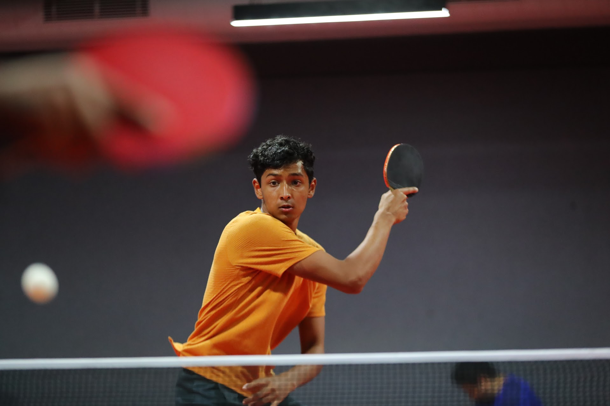

# Hello! I'm Sahil :D

## About me
I'm a second-year computer science major at UCSD (*Well, obviously*). Over my two years at UCSD, if there's something I've learned, it is
> Start early, start often

The great thing is - this applies to almost all areas of life. Turns out, not delaying things can get you better results (Shocker, I know). 

## Some random things I've never understood

One thing I've never understood is CSE professor's obsession with this code construction:

```
void foo() {
  
}
```

Here's another thing I still haven't understood - how do people type like [this](https://www.youtube.com/watch?v=S6f6wWbvQSk)!?! 

The last thing I haven't understood yet is the purpose of this [README](README.md) - maybe I'll figure it out soon. 

## Things I like
My favorite things to do outside of class are:
1. Cooking
2. Running
3. Playing table tennis



My goals for the next couple of hours are to
- [x] Finish this lab
- [ ] Go watch the sunset
- [ ] Make dinner :D

Anyways, as if that wasn't enough about me, you can learn more [here](#about-me)

